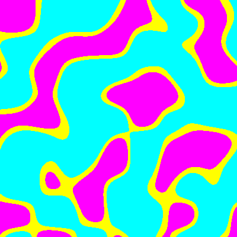
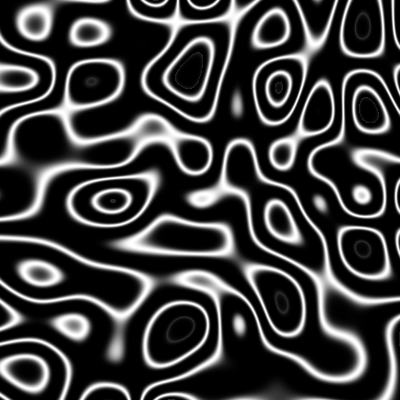

Создадим прозрачное изображение из линий в формате `.png` размером `400` на `400`, с сеткой шума в `40` шагов.
```
gen alpha lines /path/to/destination --width 400 --height 400 -t png -s 40
```

<details><summary>Результат</summary>


</details>


Создадим прозрачное изображение из "уровней" в формате `.png` размером `400` на `400`, с сеткой шума в `40` шагов.
```
gen color levels /path/to/destination --width 400 --height 400 -t png -s 40
```
<details><summary>Результат</summary>


</details>


Создадим монохромное изображение из линий в формате `.png` размером `400` на `400`, с сеткой шума в `40` шагов.
```
gen grayscale lines /path/to/destination --width 400 --height 400 -t png -s 40
```

<details><summary>Результат</summary>


</details>
