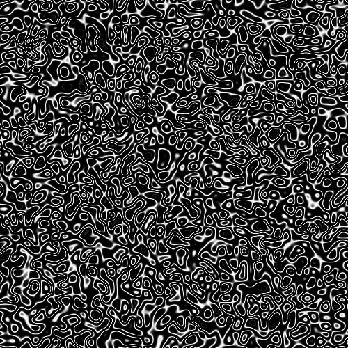

# Эффекты
Здесь описан полный список эффектов с примерами изображений. 
В будущем он может расшириться, а некоторые эффекты измениться.
Навигация: 
* [Генерация](#генерация)
* [Изменение](#изменение). 

Для лучшего понимания прочитайте [руководство][full-usage], если еще не сделали это.

## Генерация
Все сгенерированные изображения будут со стандартными значениями высоты, ширины, количества шагов, 
поэтому будем рассматривать только эффекты.

### alpha
```
alpha simple
```

```
alpha lines
```


### color
```
color simple
```

```
color levels
```


### grayscale
```
grayscale simple
```

```
grayscale lines
```

```
grayscale lines-many
```
Для стандартного шага эффект близок к обычному шуму, вот пример для `-s 50`.

```
grayscale simple-reverse
```

```
grayscale sin
```


## Изменение
Все измененные изображения будут со стандартными параметрами, в качестве исходного изображения использовать [`source_image1.jpg`][source-image].

### channels
```
channels levels-rbg
```

```
channels levels-ymc
```

```
channels levels-bmc
```


[full-usage]: ./USAGE.md
[source-image]: ./examples/source_image1.jpg