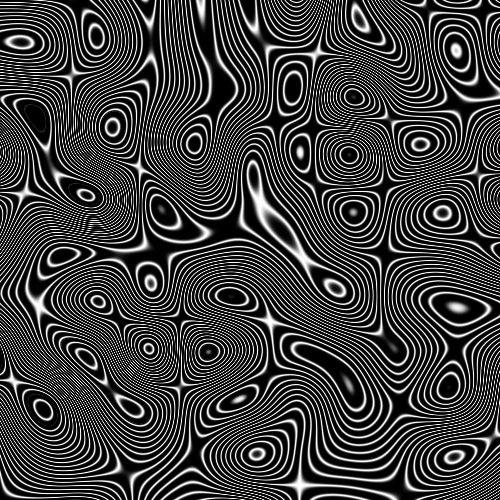
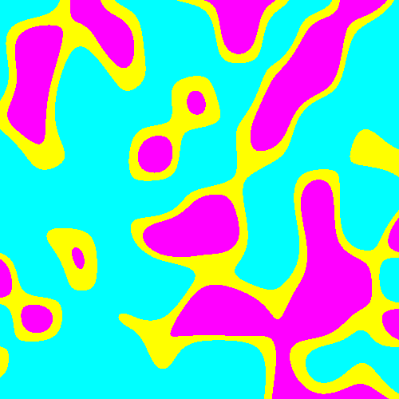
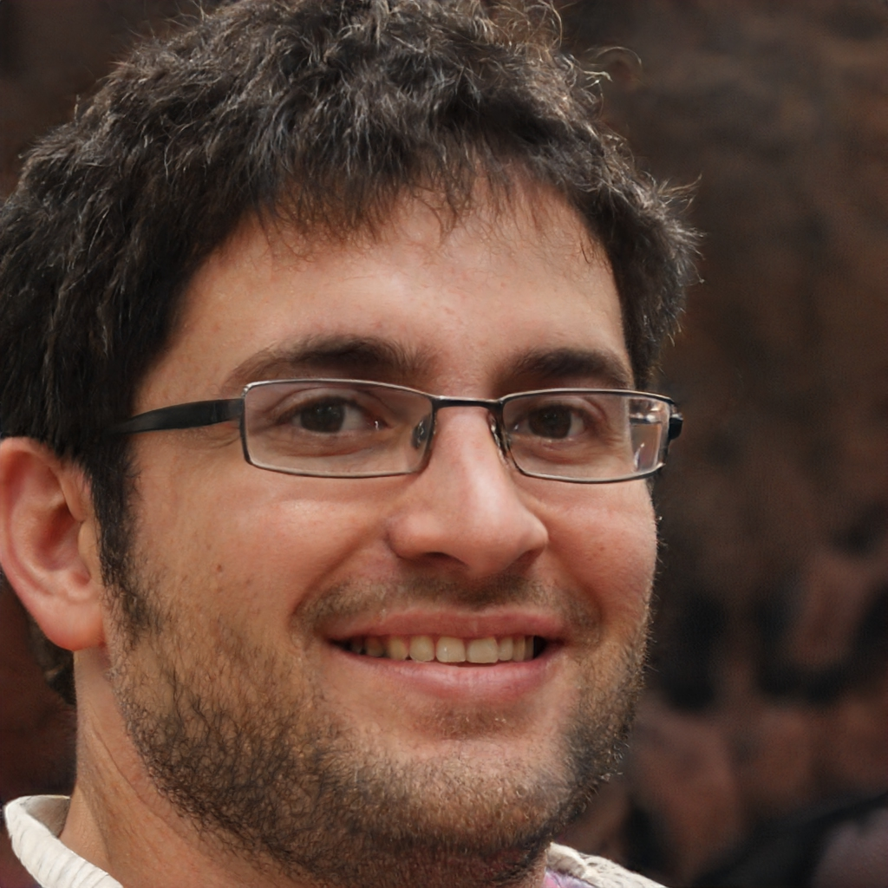
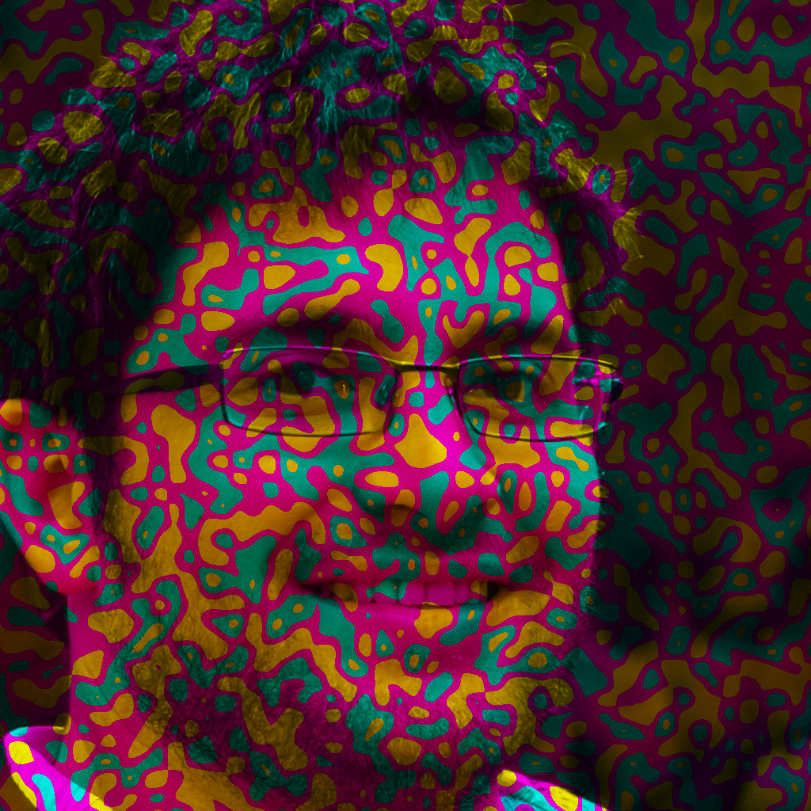
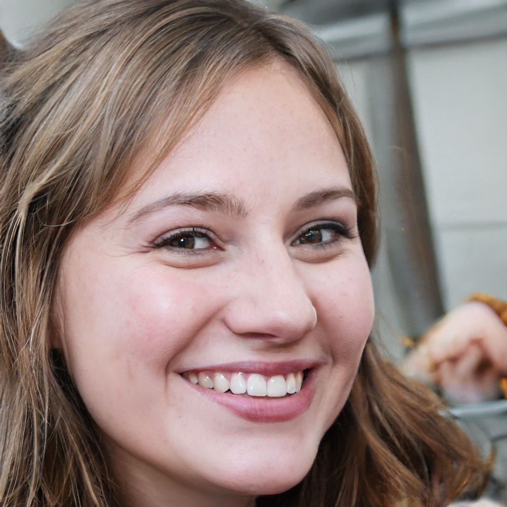
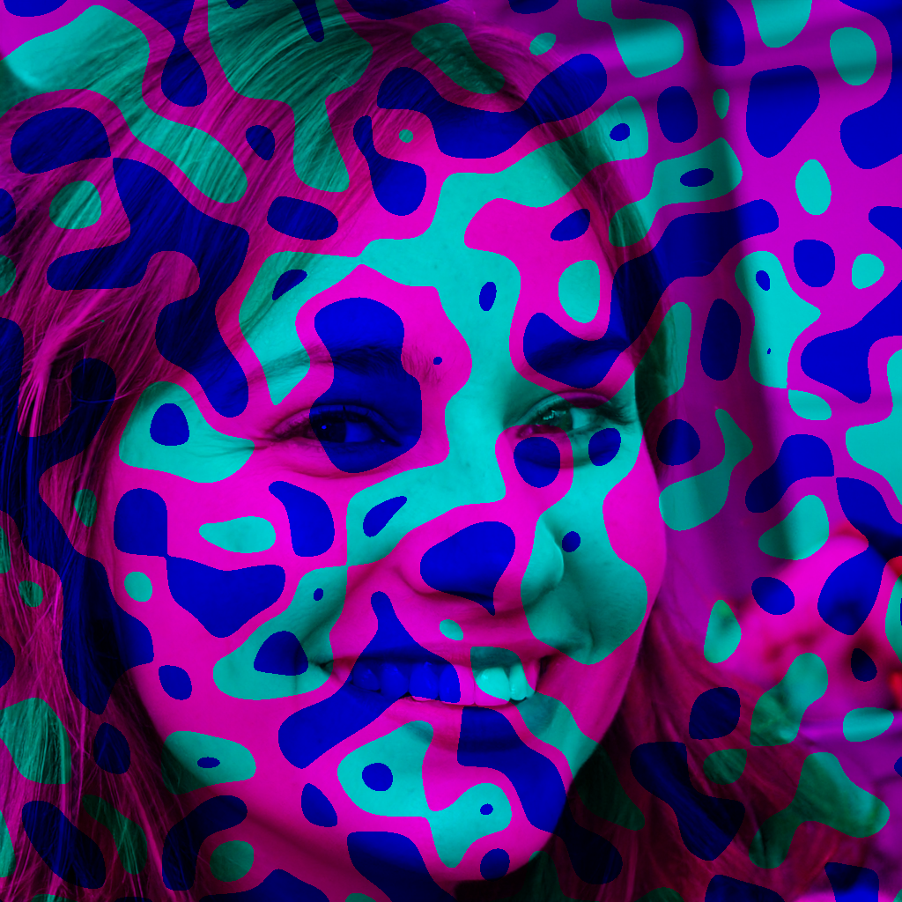

# О приложении
Приложение создано для генерации и редктирования изображений, используя обработанный шум.

## Использование

<details>
<summary>Основа выглядит так</summary>

```
noizy.py [-h] {gen,edit} ...
```
Где вместо `...` пишутся параметры, зависящие от режима (`gen` или `edit`).
</details>

Подробнее можо почитать [тут][full-usage].

#### Примеры

###### Генерация

Запустим приложение со следующими параметрами:

```
gen grayscale lines-many /path/to/destination --width 500 --height 500 -t png -s 50
```
Получим:



Попробуем:

```
gen color levels /path/to/destination --width 500 --height 500 -t png -s 50
```
Получим:




###### Изменение

В отличие от генерации, высота и ширина берутся из исходного изображения. В качестве примером будем брать изображения [отсюда][images-source].

Запустим приложение со следующими параметрами:

```
edit channels levels-ymc /path/to/source_image1.jpg /path/to/destination -t png -s 50
```
<details>
<summary>Исходное изображение</summary>


</details>

Результат:


Теперь попробуем:

```
edit channels levels-bmc /path/to/source_image2.jpg /path/to/destination -t png -s 20
```
<details>
<summary>Исходное изображение</summary>


</details>

Результат:



[images-source]: https://thispersondoesnotexist.com/ "Источник изображений"
[full-usage]: ./USAGE.md