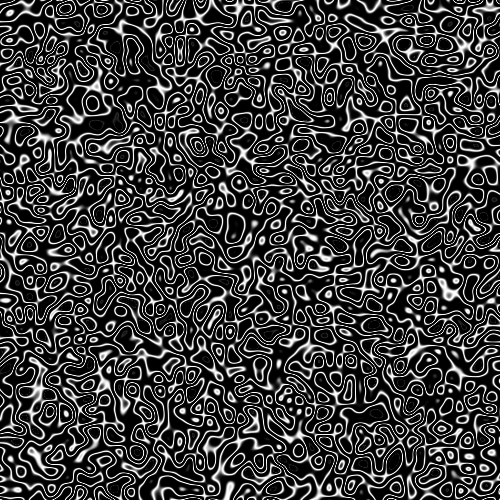
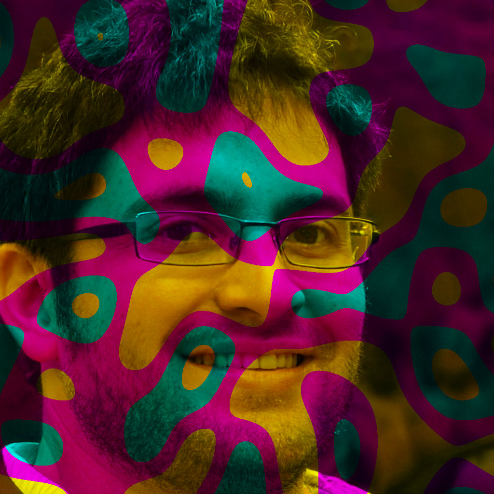

# О приложении
Приложение создано для генерации и редактирования изображений с помощью обработанного шума. Also you can read this on [english][readme-eng].

## Использование
Убедитесь, что у вас уже установлены необходимые [зависимости][requirements]. 
Подробнее про использование можно почитать [тут][full-usage], полный список эффектов с примерами [здесь][full-effects].
Чтобы создать изображение, достаточно запустить:
```shell
noizy.py gen grayscale lines /path/to/destination
```
Получим:



Для изменения:
```shell
noizy.py edit channels levels-rgb /path/to/source.image /path/to/destination
```
Получим:



Все изображения людей взяты [отсюда][images-source].

[images-source]: https://thispersondoesnotexist.com/ "Источник изображений"
[full-usage]: ./USAGE.md
[full-effects]: ./EFFECTS.md
[requirements]: ./requirements.txt
[readme-eng]: ./README_ENG.md