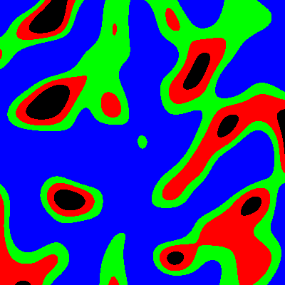
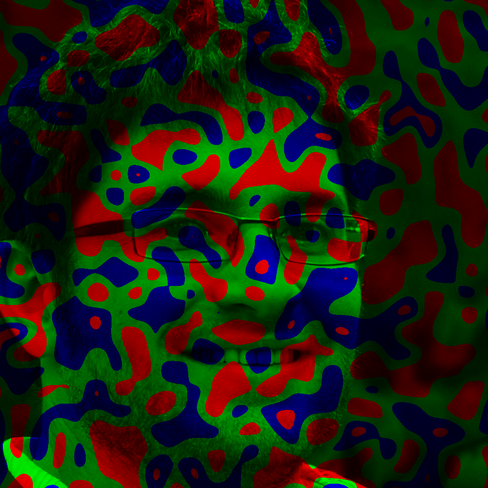

# Использование

<details>
<summary>Запустив <code>noizy.py -h</code> мы увидим не так уж много.</summary>

```
usage: noizy.py [-h] {gen,edit} ...

Application for generate or editing images using noise

optional arguments:
  -h, --help  show this help message and exit

You can use next commands:
  {gen,edit}
    gen       App will generate new image from noise
    edit      App will editing existing image

Run noizy.py <action> -h to see more details
```
</details>

Мы можем запустить `noizy.py gen -h` или `noizy.py edit -h` чтобы увидеть больше.
Давайте отдельно разберем параметры для [генерации](#параметры-генерации) и [изменения](#параметры-изменения) чуть подробнее.

## Параметры генерации

Посмотреть оригинал можно запустив приложение с параметрами `gen -h`.

|                                                  Параметр | Назначение                                                                                                                                                                                                                                              |
|----------------------------------------------------------:|---------------------------------------------------------------------------------------------------------------------------------------------------------------------------------------------------------------------------------------------------------|
|                                 `{alpha,color,grayscale}` | Выбирает группу эффектов. В зависимости от выбора эффекты будут связанны с прозрачностью или цветами. <li> `alpha`  -- эффекты, связанные с прозрачностью.</li><li> `color`  -- многоцветные эффекты.</li><li> `grayscale` -- монохромные эффекты.</li> |
| `{simple,lines,levels,simple-reverse,lines-many,sin,log}` | Выбирает  [эффект][full-effects] . Может получиться так, что эффекта нет в наборе, тогда работа программы завершится и будет выведено сообщение:  `There are no effect '<effect>' in '<base>'`.                                                        |
|                                                  `output` | Путь к директории для записи файла. Если директории не существует, приложение завершит работу с кодом  `2` и соответствующим сообщением.                                                                                                                |
|                                           `-h` , `--help` | Краткая помощь.                                                                                                                                                                                                                                         |
|                                                 `--width` | Принимает значение ширины итогового изображения. По умолчанию  `500`.                                                                                                                                                                                   |
|                                                `--height` | Принимает значение высоты итогового изображения. По умолчанию  `500`.                                                                                                                                                                                   |
|                                          `-s` , `--steps` | Принимает количество шагов шума. Например для значения  `20`  будет создан шум 21 на 21, крайние точки которого совпадают с началом во соответствующей оси, остальные точки равномерно распределены по изображению. По умолчанию  `10`.                 |
|                                           `-t` , `--type` | Принимает расширение файла на выбор из  `'jpg', 'png'` (на данный момент).                                                                                                                                                                              |

## Параметры изменения

Посмотреть оригинал можно запустив приложение с параметрами `edit -h`.

|                             Параметр | Назначение                                                                                                                                                                                      |
|-------------------------------------:|-------------------------------------------------------------------------------------------------------------------------------------------------------------------------------------------------|
|                         `{channels}` | Выбирает группу эффектов. На данный момент доступно  `'channels'`.                                                                                                                              |
| `{levels-rgb,levels-ymc,levels-bmc}` | Выбирает [эффект][full-effects]. Может получиться так, что эффекта нет в наборе, тогда работа программы завершится и будет выведено сообщение:  `There are no effect '<effect>' in '<base>'`.   |
|                              `input` | Путь к исходному изображению. Если изображения не существует, приложение завершит работу с кодом  `2` и соответствующим сообщением.                                                             |
|                             `output` | Путь к директории для записи файла. Если директории не существует, приложение завершит работу с кодом  `2` и соответствующим сообщением.                                                        |
|                      `-h` , `--help` | Краткая помощь.                                                                                                                                                                                 |
|                     `-s` , `--steps` | Принимает количество шагов. Размеры маски высчитываются на основе размеров изображения, т.о. маска всегда будет квадратами.                                                                     |
|                      `-t` , `--type` | Принимает расширение файла на выбор из  `'jpg', 'png'` (на данный момент).                                                                                                                      |

## Примеры

Прежде всего, обратите внимание, что некоторые эффекты могут быть **изменены**.
Учтите, что повторив команду у себя, Вы **не получите** такой же результат.
На данный момент доступно:
* [Генерация](#генерация)
* [Изменение](#изменение)

[Полный список эффектов с примерами][full-effects].

### Генерация

Создадим прозрачное изображение шума Перлина в формате `.png` размером `400` на `400`, с сеткой шума в `40` шагов.
```
gen alpha simple /path/to/destination --width 400 --height 400 -t png -s 40
```

<details><summary>Результат</summary>


</details>

Создадим цветное изображение в формате `.png` размером `400` на `400`, с сеткой шума в `40` шагов.
```
gen color simple /path/to/destination --width 400 --height 400 -t png -s 40
```

<details><summary>Результат</summary>


</details>

Создадим монохромное изображение шума Перлина в формате `.png` размером `400` на `400`, с сеткой шума в `40` шагов.
```
gen grayscale simple /path/to/destination --width 400 --height 400 -t png -s 40
```

<details><summary>Результат</summary>


</details>

### Изменение

Отредактируем изображение `source_image1.jpg`, сохраним в формате `.png` с сеткой шума в `25` шагов.
```
edit channels levels-rgb /path/to/source_image1.jpg /path/to/destination -t png -s 25
```

<details><summary>Результат</summary>


</details>

[full-effects]: ./EFFECTS.md