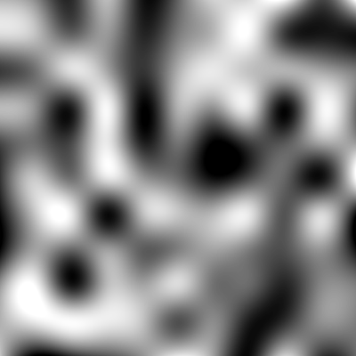
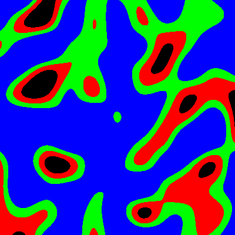
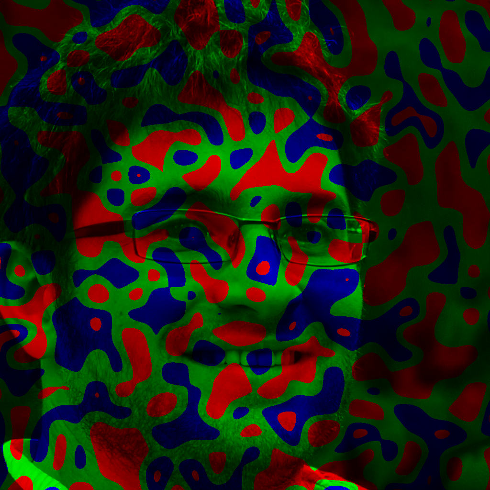

# Usage
<details>
<summary>Run <code>noizy.py -h</code> we will see not so much.</summary>

```
usage: noizy.py [-h] {gen,edit} ...

Application for generate or editing images using noise

optional arguments:
  -h, --help  show this help message and exit

You can use next commands:
  {gen,edit}
    gen       App will generate new image from noise
    edit      App will editing existing image

Run noizy.py <action> -h to see more details
```
</details>

We can run `noizy.py gen -h` or `noizy.py edit -h` to see more.
Let's review closer [generation](#generation-parameters) and [editing](#editing-parameters) parameters. Also you can jump to [examples](#examples).

## Generation parameters
To see origin run app with `gen -h` parameters.

|                                                  Parameter | Meaning                                                                                                                                                                                                                                         |
|------------------------------------------------------:|--------------------------------------------------------------------------------------------------------------------------------------------------------------------------------------------------------------------------------------------------------|
|                             `{alpha,color,grayscale}` | Defines effects group. Depends on choise effect will be conserned with transparency or colors. <li> `alpha`  -- effects concerned with transperency.</li><li> `color`  -- multicolor effects.</li><li> `grayscale` -- monochrome effects.</li>|
| `{simple,lines,levels,simple-reverse,lines-many,sin}` | Sets  [effect][full-effects]. If in group there are no such effect, then proccess will finished with message:  `There are no effect '<effect>' in '<base>'`.                                                        |
|                                              `output` | Path to writing directory. If directory doesn't exist, application will finished with code `2` and matching message.                                                                                                               |
|                                       `-h` , `--help` | Short help.                                                                                                                                                                                                                                        |
|                                             `--width` | Recieves width value. By default `500`.                                                                                                                                                                                  |
|                                            `--height` | Recieves height value. By default `500`.                                                                                                                                                                                  |
|                                      `-s` , `--steps` | Recieves count of pixels in step. Matching dimention exact divide by recieved number, then add one more point. Extreme noise points match with border of image by matching axis. By default `10`.             |
|                                       `-t` , `--type` | Recieves file type from `'jpg', 'png'` (for this moment).                                                                                                                                                                             |

## Editing parameters
To see origin run app with `edit -h` parameters.

|                             Parameter | Meaning                                                                                                                                                                                      |
|-------------------------------------:|-------------------------------------------------------------------------------------------------------------------------------------------------------------------------------------------------|
|                         `{channels}` | Defines effects group. For this moment availiable `'channels'`.                                                                                                                              |
| `{levels-rgb,levels-ymc,levels-bmc}` | Sets  [effect][full-effects]. If in group there are no such effect, then proccess will finished with message:  `There are no effect '<effect>' in '<base>'`.   |
|                              `input` | Path to source image. If file doesn't exist, application will finished with code `2` and matching message.                                                             |
|                             `output` | Path to writing directory. If directory doesn't exist, application will finished with code `2` and matching message.                                                        |
|                      `-h` , `--help` | Short help.                                                                                                                                                                                 |
|                     `-s` , `--steps` | Recieves count of steps. Mask sizes calculated using smallest image dimention, rather mask always will be squares-shaped. By default `10`.                                                  |
|                      `-t` , `--type` | Recieves file type from `'jpg', 'png'` (for this moment).                                                                                                                      |

## Examples
First of all, notice that effcts can be **changed**.
Notice that if you run same command you **will not get** same result.
For this moment availiable:
* [Generation](#generation)
* [Editing](#editing)

[Full effects list with examples][full-effects].

### Generation
Create transparent image of Perlin's noise in format `.png`, size `400` by `400`, with noise mesh `40` pixels by step.
```
gen alpha simple /path/to/destination --width 400 --height 400 -t png -s 40
```
<details><summary>Result</summary>


</details>

Create multicolor image in format `.png`, size `400` by `400`, with noise mesh `40` pixels by step.
```
gen color simple /path/to/destination --width 400 --height 400 -t png -s 40
```
<details><summary>Result</summary>


</details>

Create monochrome image of Perlin's noise in format `.png`, size `400` by `400`, with noise mesh `40` pixels by step.
```
gen grayscale simple /path/to/destination --width 400 --height 400 -t png -s 40
```
<details><summary>Result</summary>


</details>

### Editing
Edit image `source_image1.jpg`, save in format `.png` with noise mesh `25` steps.
```
edit channels levels-rgb /path/to/source_image1.jpg /path/to/destination -t png -s 25
```
<details><summary>Result</summary>


</details>

[full-effects]: ./EFFECTS.md